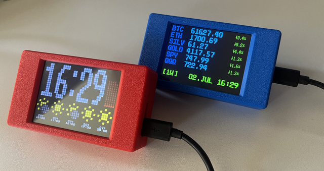
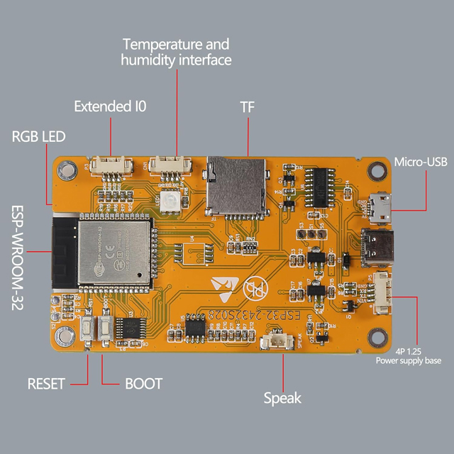
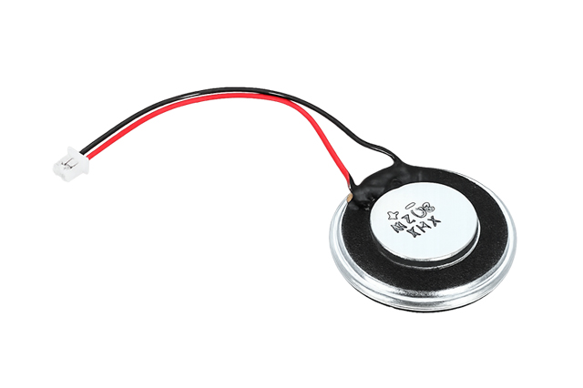

# Retro Clock

## Features

**Four screens** — tap the **left or right edge** of the display to switch between them, and **tap a widget** to change its style (e.g. switch weather forecast, crypto timeframe):
1. **Main** — time (HH:MM), a live seconds indicator (hourglass that fills up, or digits) and a **10-hour weather forecast**.
2. **Big Clock** — oversized time plus the current temperature.
3. **Crypto / Finance** — live prices of your chosen assets (crypto, gold, silver, indices…) with the % change; tap to cycle the timeframe (**1H … 1Y**).
4. **Egg Timer** — a minute/second countdown with Start/Stop and an alarm melody.

**More features**
- **Weather** — hourly forecast with icons. **No API key needed.**
- **Finance ticker** — live prices via Binance, freely choose your symbols. **No API key needed.**
- **Price alerts** — get a sound + a red price when a coin crosses a limit you set (e.g. `BTC>50000`).
- **Alarm clock** — set a wake time + weekdays; it plays a melody (tap the screen to stop).
- **Egg timer** — countdown with selectable alarm tunes.
- **Automatic time** — synced over the internet (NTP) using your time zone and daylight-saving rules.
- **Display comfort** — adjustable brightness, **night mode** (auto-dim during a time window), **auto screen-off** after inactivity (tap anywhere to wake), and a *hold-the-centre* gesture to turn the screen off.
- **Personalisation** — 12/24-hour format, seconds as hourglass or numbers, colours for digits/temperature/crypto, 180° screen flip, and a selectable start screen.
- **Easy setup** — configured entirely from your phone's browser: no app, no account, no API keys.
- **Over-the-air updates** — upload new firmware right from the settings page.
- **Settings are kept** across firmware updates.

---

## Setup (no programming needed)

A simple, step-by-step guide to get your RetroClock running on the ESP32

**You need**
- The **[Cheap Yellow Display (CYD, 2432S028)](https://amzn.eu/d/0baJBjMG)** and a **USB data cable** (some cables only charge, use a real data cable). 

- A computer with **Google Chrome, Microsoft Edge, or Opera** (desktop). Safari, Firefox and phones cannot flash.
- Your phone (to enter the settings)
- Optional: A small **[passive piezo buzzer / speaker](https://www.amazon.de/dp/B0DS6BHJ55)** (for the egg-timer and alarm sound)

- Optional: Case with PiP kickstand (STL file for 3D printing is included)

---

## 1. Connect the speaker (optional)
1. Connect a small passive buzzer / speaker between **pin GPIO 26** and **GND** on the CYD's side pin header.
2. That's it, without a speaker the clock still works, you just won't hear the timer/alarm.

## 2. Plug the device into your PC
1. Connect the CYD to your computer with the USB cable.
2. If nothing lights up, try another USB cable or port (charge-only cables don't work).

## 3. Flash the firmware from the website
1. On your **computer**, open **https://seizu.github.io/RetroClockInstaller** in **Chrome, Edge, or Opera**.
2. Click **Install / Connect**.
3. In the popup, select the device's serial port (often shown as **"USB-SERIAL CH340"**) and confirm.
4. Wait until it finishes and the board restarts, the clock appears on the display.

## 4. Connect your phone to the device (hotspot)
On the first start there is no WiFi yet, so the device opens its own hotspot.
The display shows **AP MODE**, a **WiFi name (SSID)** and a **web address**.
1. On your **phone**, open WiFi settings.
2. Connect to the **WiFi name shown on the display**.
3. Password: **`RetroClock`**
4. Ignore any "no internet" warning, that is normal for a setup hotspot.

## 5. Open the settings page
1. On your phone, open a web browser.
2. Type the web address shown on the display **`http://10.100.10.1`**
3. The RetroClock settings page opens.

## 6. Enter the important settings
Fill in at least these, then go to step 7:
1. **WiFi SSID**, the name of your home WiFi (must be **2.4 GHz**).
2. **WiFi Password**, your home WiFi password.
3. **Weather Latitude** and **Weather Longitude**, your location, for the weather forecast.
4. **Posix Timezone String**, your local time zone (needed for correct time and automatic daylight-saving).

(Everything else, colours, brightness, night mode, alarm time/sound, start screen, is optional and can be changed anytime.)

## 7. Save and restart
1. Tap **Save**.
2. Tap **Done/Reboot**.
3. The device restarts, joins your home WiFi, syncs the time automatically and shows the weather.

---

## Tip: get the values easily with an AI assistant
You don't need to look these up by hand, just ask any AI (e.g. ChatGPT / Claude):

- **Location:** *"What are the latitude and longitude of &lt;your town&gt;?"* → enter the two numbers into **Latitude** / **Longitude**.
- **Time zone:** *"What is the POSIX TZ string for &lt;your country/city&gt;?"* → paste it into **Posix Timezone String**.

Examples:
| Region | POSIX Timezone String |
|---|---|
| Central Europe (Vienna, Berlin, Paris) | `CET-1CEST,M3.5.0/2,M10.5.0/3` |
| UK (London) | `GMT0BST,M3.5.0/1,M10.5.0` |
| US East (New York) | `EST5EDT,M3.2.0,M11.1.0` |
| US Pacific (Los Angeles) | `PST8PDT,M3.2.0,M11.1.0` |

---

## Change settings later
- **Normal re-config:** while the device is on your WiFi, open its **IP address** (shown briefly on the display at boot) in a browser.
- **Start over / factory reset:** hold a finger on the **touchscreen while powering the device on**. It reopens the setup hotspot **and resets all settings to defaults**.

---

## WebPrefs glossary
Every option on the settings page, with a short note on what it does and how to set it. Colours are **palette indices 1–31** (0 = multicolor where allowed). A **toggle** is an on/off switch. Changes to plain text fields apply after **Save + Reboot**; toggles and a few live fields (brightness, volume, alarm) apply instantly.

### Display Settings
| Setting | What it does / how to use |
|---|---|
| Alarm Active | Live switch: **on** while any alarm/tone is sounding. Turn **off** to stop the sound immediately. |
| Initial Screen | Which screen shows after boot: **1** Main, **2** Big Clock, **3** Crypto, **4** Egg Timer. |
| Flip Screen | **On** rotates the whole display 180° (for upside-down mounting). |
| Clock Digits Color | Colour of the clock digits (1–31). |
| Small Temp Color | Colour of the small temperature on the Main screen (0 = multicolor). |
| Big Temp Color | Colour of the large temperature on the Big Clock screen (1–31). |
| Hourglass BG Color | Background colour of the hourglass seconds indicator (1–31). |
| Hourglass FG Color | Fill colour of the hourglass (1–31). |
| Hourglass | **On** = seconds as a filling hourglass, **off** = numeric seconds. |
| 24 Hour Format | **On** = 24-hour time, **off** = 12-hour. |
| Weather Latitude | Your location's latitude (−90…90) for the weather forecast. |
| Weather Longitude | Your location's longitude (−180…180) for the weather forecast. |
| Display Off After Seconds | Auto screen-off after inactivity: **0** = never, else **10–300 s** (tap to wake). |
| Display Brightness % | Backlight brightness during the day (1–100). |
| Night Brightness % | Brightness inside the night window: **0** = screen off, else 1–100. |
| Night From | Start of the night-dim window (HH:MM). Set **From = To** to disable night mode. |
| Night To | End of the night-dim window (HH:MM). |
| Volume % | Master volume (0–100) scaling all sounds: alarm, egg-timer, price alert. |
| Alarm Sound | Melody for the wake alarm and egg-timer (1–5). |
| Alarm Time | Wake time for the alarm clock (HH:MM). |
| Alarm Days | 7 digits Mon→Sun, 1 = on (e.g. `1111100` = weekdays). **All zeros = alarm off.** |
| Crypto Timeframe on Boot | Chart timeframe shown at boot on the Crypto screen (1–9 = 1H…1Y). |
| Crypto Symbol Color | Colour of the asset symbols (0 = multicolor, 1–31). |
| Crypto Price Color | Colour of the prices (0 = multicolor, 1–31). |
| Crypto Date/Time Color | Colour of the date/time on the Crypto screen (0 = multicolor, 1–31). |
| Crypto Assets | Up to 6 assets as `Name,BinanceSymbol,Digits;…` (e.g. `BTC,BTCUSDT,2;GOLD,XAUUSDT,2`). |
| Crypto Price Alerts | Alerts as `SYM>val` or `SYM<val`, separated by `;` (e.g. `BTC>50000;ETH<2000`). Prefix `?` = inactive. |
| Crypto Alert Sound | Melody played when a price alert triggers (1–5). |
| Crypto Alert Color | Price colour while an asset is in alert (1–31). |

### WiFi / Network
| Setting | What it does / how to use |
|---|---|
| WiFi SSID | Name of your home WiFi (**2.4 GHz only**). |
| WiFi Password | Your home WiFi password (min. 8 characters). |
| WiFi Check Interval | How often the connection is checked and reconnected (5–65535 s). |
| AP Fallback Attempts | After this many failed home-WiFi connects, open the setup hotspot. **0** = never. |
| AP Mode | **On** = run only as its own hotspot (no home WiFi). Disables the Static-IP option. |
| AP WiFi Password | Password of the device's own hotspot (min. 8 characters). |
| AP Channel | WiFi channel of the hotspot (1–13). |
| Static IP | **On** = use the fixed address below, **off** = automatic (DHCP). Enables the 5 fields below. |
| IP Address | Device's fixed IPv4 address (only used when Static IP is on). |
| Subnetmask | Network subnet mask (e.g. `255.255.255.0`). |
| Gateway Address | Your router's IP address. |
| DNS Server Address 1 | Primary DNS server (e.g. `1.1.1.1`). |
| DNS Server Address 2 | Secondary DNS server (e.g. `1.0.0.1`). |

### WebPrefs Interface Settings
| Setting | What it does / how to use |
|---|---|
| WebPrefs Login | **On** = require a username + password to open this settings page. Enables the two fields below. |
| WebPrefs User | Username for the settings-page login. |
| WebPrefs Password | Password for the settings-page login. |

### System Clock
| Setting | What it does / how to use |
|---|---|
| NTP Sync | **On** = get the time automatically from the internet; **off** = set it manually via *Date Time*. |
| NTP Server | Time-server hostname (e.g. `at.pool.ntp.org`). |
| GMT offset | Seconds offset from UTC. **Only used when the Timezone String is empty.** |
| Daylight saving time | Extra seconds during summer time. **Only used when the Timezone String is empty.** |
| Posix Timezone String | POSIX TZ rule for automatic zone + daylight saving; overrides the two offsets above (see examples). |
| Date Time | Manual clock set as `YYYY-MM-DD HH:MM:SS` (used when NTP Sync is off). |

### Buttons
| Button | What it does / how to use |
|---|---|
| Save | Writes all current settings to the device's flash memory. **Text fields are only kept after Save** (toggles and live fields apply on the spot). |
| Done/Reboot | Restarts the device so settings that need a reboot take effect, and closes the settings page. Use it after **Save**. |
| Browse File | Pick a firmware or filesystem `.bin` file from your phone/computer for the update below. |
| Update Firmware | Flashes the selected `.bin` as new firmware over WiFi (OTA) — no cable needed. The device reboots when done. |
| Update LittleFS | Flashes the selected `.bin` as the filesystem image (fonts/graphics), also over WiFi. Only needed when those assets change. |

---

## APIs & commercial use

The code is **MIT-licensed** and free to use. It does, however, rely on third-party APIs (**Binance**, **Open-Meteo**) whose free access is intended for private, non-commercial use. If you intend to use this project commercially, you are responsible for obtaining the appropriate commercial API access/agreements from those providers.